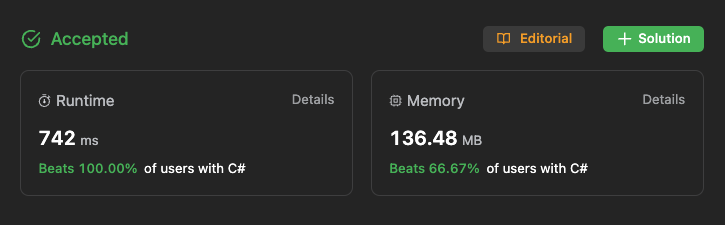

# Challenge

https://leetcode.com/problems/design-a-food-rating-system

# First Try

```csharp
namespace FoodRatings;

record struct FoodRow(string Food, string Cuisine, int Rating)
{
	public string GetKey()
	{
		return Food;
	}
};

public class FoodRatings
{
	Dictionary<string, FoodRow> FoodTable = new();

	public FoodRatings(string[] foods, string[] cuisines, int[] rating)
	{
		for (int i = 0; i < foods.Length; i++)
		{
			var row = new FoodRow(foods[i], cuisines[i], rating[i]);

			FoodTable.Add(row.GetKey(), row);
		}
	}

	public void ChangeRating(string food, int newRating)
	{
		var row = FoodTable.FirstOrDefault(x => x.Key == food);
		if (row.Key == null) return;
				
		FoodTable[row.Key] = row.Value with { Rating = newRating };
	}
	public string HighestRated(string cuisine)
	{
		var row = FoodTable
			.Where(x => x.Value.Cuisine == cuisine)
			.OrderByDescending(x => x.Value.Rating)
			.ThenBy(x => x.Value.Food)
			.First();

		return row.Value.Food;
	}
}
```

# Problem

72 / 77 testcases passed
Time Limit Exceeded


# Second Try

```csharp
namespace FoodRatings;

record struct FoodRow(string Food, string Cuisine, int Rating);

public class FoodRatings
{
	Dictionary<int, FoodRow> FoodTable = new();

    // Added Indexes for faster search
	Dictionary<string, int[]> IdxCuisine = new();
	Dictionary<string, int[]> IdxFood = new();

	public FoodRatings(string[] foods, string[] cuisines, int[] rating)
	{
		for (int i = 0; i < foods.Length; i++)
		{
			var row = new FoodRow(foods[i], cuisines[i], rating[i]);
			FoodTable.Add(i, row);
			
			if (IdxCuisine.ContainsKey(cuisines[i]))
			{
				var keys = IdxCuisine[cuisines[i]].Concat(new[] { i }).ToArray();
				IdxCuisine[cuisines[i]] = keys;
			}
			else
			{
				IdxCuisine.Add(cuisines[i], new[] { i });
			}
			
			if (IdxFood.ContainsKey(foods[i]))
			{
				var keys = IdxFood[foods[i]].Concat(new[] { i }).ToArray();
				IdxFood[foods[i]] = keys;
			}
			else
			{
				IdxFood.Add(foods[i], new[] { i });
			}
		}
	}

	public void ChangeRating(string food, int newRating)
	{
        // Move to O(1) search
		if (IdxFood.TryGetValue(food, out var idxs))
		{
			FoodTable[idxs.First()] = FoodTable[idxs.First()] with { Rating = newRating };
		}
	}
	public string HighestRated(string cuisine)
	{
		Dictionary<int, FoodRow> rows = new();
		
		if (IdxCuisine.TryGetValue(cuisine, out var idxs))
		{
			foreach (var idx in idxs)
			{
				rows.Add(idx, FoodTable[idx]);
			}
		}
		
		var row = rows
        // Remove the where clause
        // .Where(x => x.Value.Cuisine == cuisine)
			.OrderByDescending(x => x.Value.Rating)
			.ThenBy(x => x.Value.Food)
			.First();
		
		return row.Value.Food;
	}
}
```


# Problem

73 / 77 testcases passed
Time Limit Exceeded


# Thirth Try

```csharp
record struct FoodRow(string Food, string Cuisine, int Rating);

public class FoodRatings
{
	Dictionary<int, FoodRow> FoodTable = new();
    // Move int to List<int>
	Dictionary<string, List<int>> IdxCuisine = new();
	Dictionary<string, List<int>> IdxFood = new();

	public FoodRatings(string[] foods, string[] cuisines, int[] rating)
	{
		for (int i = 0; i < foods.Length; i++)
		{
			var row = new FoodRow(foods[i], cuisines[i], rating[i]);
			FoodTable.Add(i, row);
			
            // Remove Concat inside loop
			UpdateIndex(IdxCuisine, cuisines[i], i);
			UpdateIndex(IdxFood, foods[i], i);
		}
	}

    // Move logic to avoid code duplication
	private void UpdateIndex(Dictionary<string, List<int>> indexes, string key, int value)
	{
		if (indexes.ContainsKey(key))
		{
			indexes[key].Add(value);
		}
		else
		{
			indexes[key] = new List<int>() { value };
		}
	} 

	public void ChangeRating(string food, int newRating)
	{
		if (IdxFood.TryGetValue(food, out var idxs))
		{
			FoodTable[idxs.First()] = FoodTable[idxs.First()] with { Rating = newRating };
		}
	}
	public string HighestRated(string cuisine)
	{
		Dictionary<int, FoodRow> rows = new();
		
		if (IdxCuisine.TryGetValue(cuisine, out var idxs))
		{
			foreach (var idx in idxs)
			{
				rows.Add(idx, FoodTable[idx]);
			}
		}
		
		var row = rows
			.OrderByDescending(x => x.Value.Rating)
			.ThenBy(x => x.Value.Food)
			.First();
		
		return row.Value.Food;
	}
}
```

# Problem

73 / 77 testcases passed
Time Limit Exceeded

# Fourth Try

```csharp
namespace FoodRatings;

record struct FoodRow(string Food, string Cuisine, int Rating);

public class FoodRatings
{
	Dictionary<int, FoodRow> FoodTable = new();
	Dictionary<string, List<int>> IdxCuisine = new();
	Dictionary<string, List<int>> IdxFood = new();

	public FoodRatings(string[] foods, string[] cuisines, int[] rating)
	{
		for (int i = 0; i < foods.Length; i++)
		{
			var row = new FoodRow(foods[i], cuisines[i], rating[i]);
			FoodTable.Add(i, row);
			
			UpdateIndex(IdxCuisine, cuisines[i], i);
			UpdateIndex(IdxFood, foods[i], i);
		}
	}

	private void UpdateIndex(Dictionary<string, List<int>> indexes, string key, int value)
	{
		if (indexes.ContainsKey(key))
		{
			indexes[key].Add(value);
		}
		else
		{
			indexes[key] = new List<int>() { value };
		}
	} 

	public void ChangeRating(string food, int newRating)
	{
		if (IdxFood.TryGetValue(food, out var idxs))
		{
			FoodTable[idxs.First()] = FoodTable[idxs.First()] with { Rating = newRating };
		}
	}
	public string? HighestRated(string cuisine)
	{
		Dictionary<int, FoodRow> rows = new();
		
		if (IdxCuisine.TryGetValue(cuisine, out var idxs))
		{
			foreach (var idx in idxs)
			{
				rows.Add(idx, FoodTable[idx]);
			}
		}

        // order by rating
		var test = rows
			.OrderByDescending(x => x.Value.Rating).ToList();

		int lastRating = 0;
		List<string> foods = new();
		
		// stop search when rating is lower than last rating
		for (int i = 0; i < test.Count; i++)
		{
			if (test[i].Value.Rating < lastRating)
			{
				break;
			}
			if (test[i].Value.Rating >= lastRating)
			{
				lastRating = test[i].Value.Rating;
				foods.Add(test[i].Value.Food);
			}
		}

		if (foods.Count == 0) return null;

		return foods.OrderBy(x => x).First();
	}
}
```

# Problem

73 / 77 testcases passed
Time Limit Exceeded


# Last Try

```csharp
using System.Collections.Generic;
using System.Linq;

namespace FoodRatings
{
    record Food(string Name, int Rating);

    public class FoodRatings
    {
        private Dictionary<string, int> _foodRatings = new Dictionary<string, int>();
        private Dictionary<string, List<string>> _cuisineFoods = new Dictionary<string, List<string>>();

        public FoodRatings(string[] foods, string[] cuisines, int[] ratings)
        {
            for (int i = 0; i < foods.Length; i++)
            {
                _foodRatings[foods[i]] = ratings[i];

                if (!_cuisineFoods.ContainsKey(cuisines[i]))
                {
                    _cuisineFoods[cuisines[i]] = new List<string>();
                }

                _cuisineFoods[cuisines[i]].Add(foods[i]);
            }
        }

        public void ChangeRating(string food, int newRating)
        {
            if (_foodRatings.ContainsKey(food))
            {
                _foodRatings[food] = newRating;
            }
        }

        public string? HighestRated(string cuisine)
        {
            if (!_cuisineFoods.ContainsKey(cuisine))
            {
                return null; // No matching cuisine found
            }

            var foods = _cuisineFoods[cuisine]
                .Select(f => new Food(f, _foodRatings[f]));

            var maxRating = foods.Max(f => f.Rating);

            var highestRatedFoods = foods.Where(f => f.Rating == maxRating)
                .OrderBy(f => f.Name)
                .ToList();

            if (highestRatedFoods.Count == 0)
            {
                return null;
            }

            return highestRatedFoods.First().Name;
        }
    }
}
```

# Problem

73 / 77 testcases passed
Time Limit Exceeded


# Solution

I give up. 

The solution i found based on priority queue written in Java

Link: https://leetcode.com/problems/design-a-food-rating-system/solutions/4414602/beats-100-explained-with-video-hashmap-priority-queue-c-java-python-js-visualized/


Full code in C#:

```csharp
public class FoodRatingsBasedOnQueue
{
    public class Info
    {
        public string Food { get; set; }
        public string Cuisine { get; set; }
        public int Rating { get; set; }

        public Info(string food, string cuisine, int rating)
        {
            Food = food;
            Cuisine = cuisine;
            Rating = rating;
        }
    }

    private Dictionary<string, PriorityQueue<Info>> cuisineMap;
    private Dictionary<string, Info> foodMap;

    public FoodRatingsBasedOnQueue(string[] foods, string[] cuisines, int[] ratings)
    {
        cuisineMap = new Dictionary<string, PriorityQueue<Info>>();
        foodMap = new Dictionary<string, Info>();

        for (int i = 0; i < foods.Length; i++)
        {
            Info combo = new Info(foods[i], cuisines[i], ratings[i]);
            foodMap.Add(foods[i], combo);

            if (cuisineMap.ContainsKey(cuisines[i]))
            {
                cuisineMap[cuisines[i]].Enqueue(combo);
            }
            else
            {
                PriorityQueue<Info> pq = new PriorityQueue<Info>((a, b) =>
                {
                    int result = b.Rating - a.Rating;
                    if (result == 0)
                    {
                        return String.Compare(a.Food, b.Food, StringComparison.Ordinal);
                    }
                    return result;
                });
                pq.Enqueue(combo);
                cuisineMap.Add(cuisines[i], pq);
            }
        }
    }

    public void ChangeRating(string food, int newRating)
    {
        Info prev = foodMap[food];
        Info curr = new Info(food, prev.Cuisine, newRating);
        foodMap[food] = curr;
        prev.Food = "";
        cuisineMap[prev.Cuisine].Enqueue(curr);
    }

    public string HighestRated(string cuisine)
    {
        while (cuisineMap[cuisine].Peek().Food.Equals(""))
        {
            cuisineMap[cuisine].Dequeue();
        }
        return cuisineMap[cuisine].Peek().Food;
    }
}

// PriorityQueue implementation in C#
public class PriorityQueue<T>
{
    private List<T> heap;
    private Comparison<T> comparison;

    public int Count { get { return heap.Count; } }

    public PriorityQueue(Comparison<T> comparison)
    {
        this.heap = new List<T>();
        this.comparison = comparison;
    }

    public void Enqueue(T item)
    {
        heap.Add(item);
        int index = heap.Count - 1;

        while (index > 0)
        {
            int parentIndex = (index - 1) / 2;
            if (comparison(heap[index], heap[parentIndex]) >= 0)
                break;

            Swap(index, parentIndex);
            index = parentIndex;
        }
    }

    public T Dequeue()
    {
        int lastIndex = heap.Count - 1;
        T frontItem = heap[0];
        heap[0] = heap[lastIndex];
        heap.RemoveAt(lastIndex);

        lastIndex--;

        int parentIndex = 0;
        while (true)
        {
            int childIndex = parentIndex * 2 + 1;
            if (childIndex > lastIndex)
                break;

            int rightChildIndex = childIndex + 1;
            if (rightChildIndex <= lastIndex && comparison(heap[rightChildIndex], heap[childIndex]) < 0)
                childIndex = rightChildIndex;

            if (comparison(heap[parentIndex], heap[childIndex]) <= 0)
                break;

            Swap(parentIndex, childIndex);
            parentIndex = childIndex;
        }

        return frontItem;
    }

    public T Peek()
    {
        return heap[0];
    }

    private void Swap(int i, int j)
    {
        (heap[i], heap[j]) = (heap[j], heap[i]);
    }
}
```


