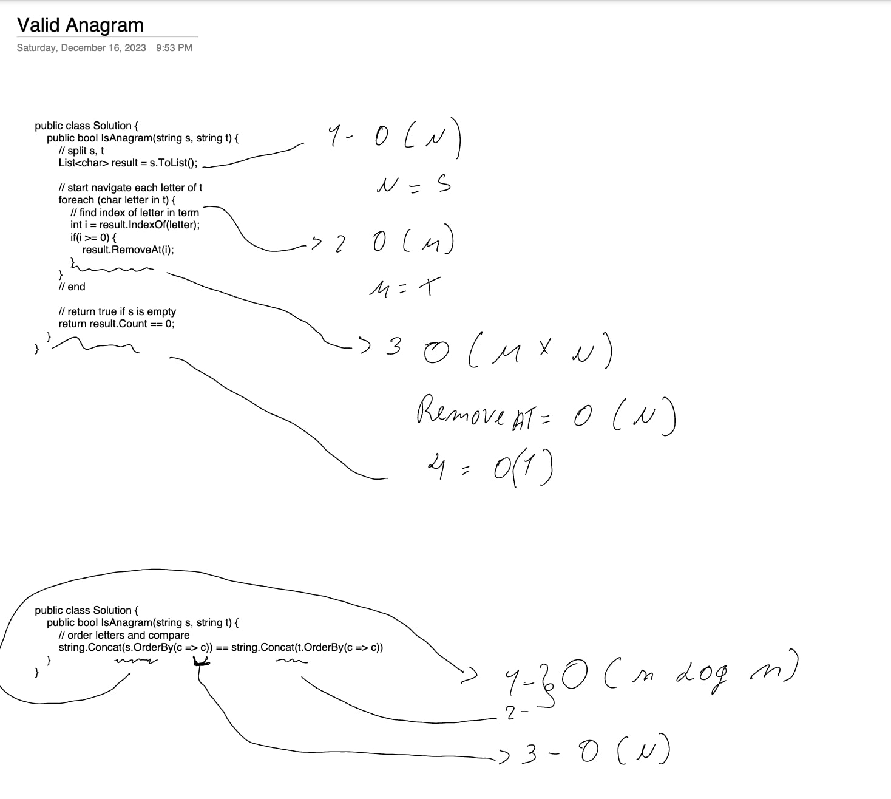
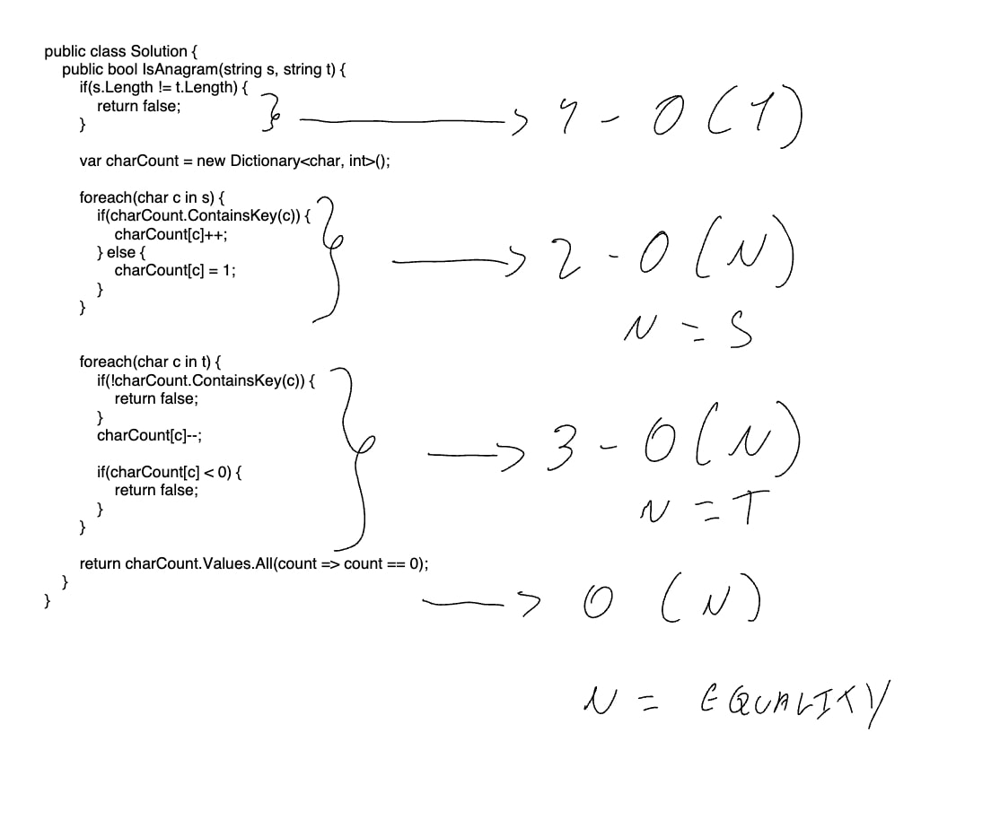

# Challenge

https://leetcode.com/problems/valid-anagram

# First Try

```csharp
public class Solution {
    public bool IsAnagram(string s, string t) {
        if(s.Length != t.Length) {
            return false;
        }
        // split s, t
        List<char> result = s.ToList();

        // start navigate each letter of t
        foreach (char letter in t) {
            // find index of letter in term
            int i = result.IndexOf(letter);
            if(i >= 0) {
                result.RemoveAt(i);
            }
        }
        // end

        // return true if s is empty
        return result.Count == 0;
    }
}
```

Notation:
1 - O(1) - Equality constant
2 - O (n) - n is the length of s
3 - O (m) - m is the length of t
4 - O(n * m) - n is the length of s, m is the length of t
5 - O(1) - result.Count is a constant

## Test Result
Runtime: 40.66MB
Memory: 
Beats 6.38% of users with C#
Beats 26.75% of users with C#

# Second try

```csharp
public class Solution {
    public bool IsAnagram(string s, string t) {
        return string.Concat(s.OrderBy(c => c)) == string.Concat(t.OrderBy(c => c));
    }
}
```

Notation:
1 - O (n log n)
2 - O (n log n) - both sort are O(n log n)
3 - O(n) - equailty

## Test Result
Runtime: 108ms
Memory: 42.96MB
Beats 14.91% of users with C#
Beats 12.55% of users with C#



# Third try

```csharp
public class Solution {
    public bool IsAnagram(string s, string t) {
        if(s.Length != t.Length) {
            return false;
        }

        var charCount = new Dictionary<char, int>();

        foreach(char c in s) {
            if(charCount.ContainsKey(c)) {
                charCount[c]++;
            } else {
                charCount[c] = 1;
            }
        }


        foreach(char c in t) {
            if(!charCount.ContainsKey(c)) {
                return false;
            }
            charCount[c]--;

            if(charCount[c] < 0) {
                return false;
            }
        }

        return charCount.Values.All(count => count == 0);
    }
}
```

Notation:
1 - O (n) - size of s
2 - O (n) - size of t
3 - O (n) - equailty

## Test Result
Runtime: 65ms
Memory: 39.97MB
Beats 37.16%of users with C#
Beats 55.99%of users with C#


